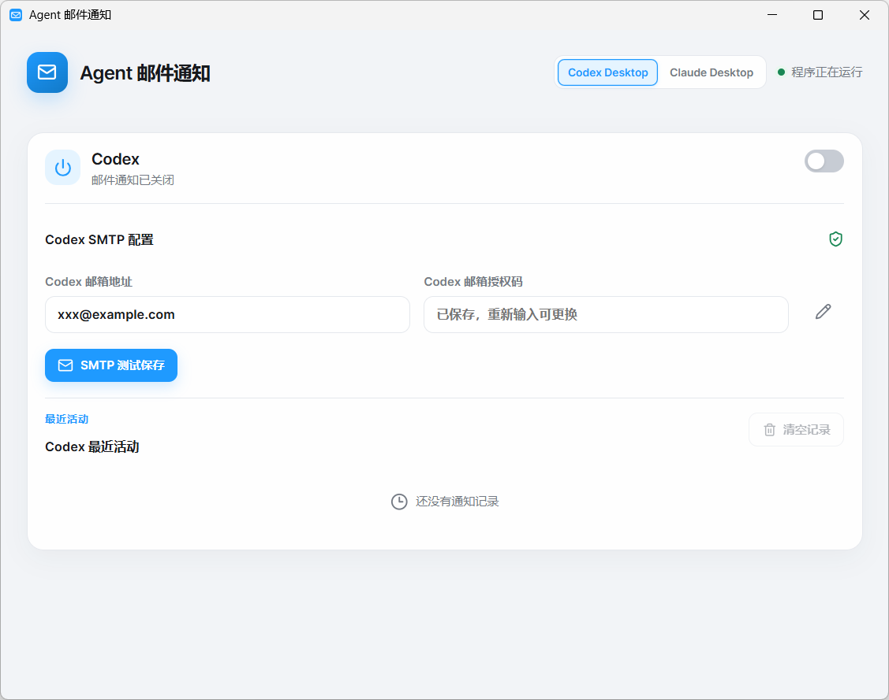
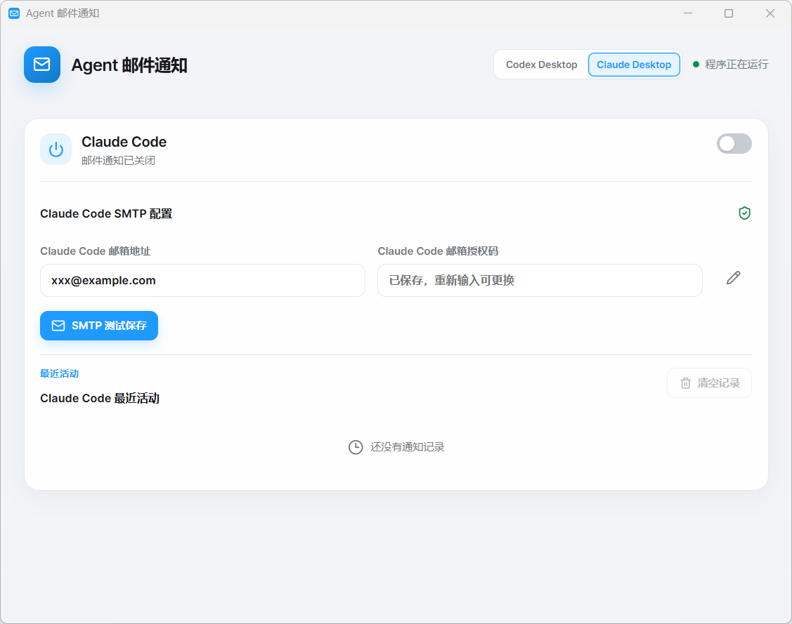

<h1 align="center">Agent Mail Notifier</h1>

<p align="center"><b>Email notifications for finished Codex Desktop / Claude Code Desktop tasks</b> (Tauri 2 + Rust + React)</p>

<p align="center">
  <a href="LICENSE"></a>
  <a href="https://github.com/ParatrooperY/AgentMailNotifier/releases"></a>
  
</p>

<p align="center"><b>English</b> · <a href="README.md">简体中文</a></p>

## What this is

Sends you an email when a Codex Desktop or Claude Code Desktop task finishes. Leave long jobs running unattended — when a turn ends, or fails and needs you, a mail arrives.

The app only reads the two clients' session transcripts to decide whether a task finished; it never writes to their configuration. SMTP authorization codes are handed to Windows Credential Manager instead of being stored in the settings file.

## Features

- **Isolated channels**: separate sender mailboxes for Codex Desktop and Claude Code Desktop; separate activity history; the tray menu toggles either one on its own.
- **Credential safety**: SMTP authorization codes go into Windows Credential Manager; the settings file keeps only host, port, encryption and other non-secret fields; the input is cleared after a successful test.
- **Provider presets**: QQ / Foxmail, NetEase 163 / 126 / yeah.net, Outlook / Hotmail / Live and Gmail fill in host and port automatically; anything else takes a manual host, port and SSL or STARTTLS.
- **Read-only listeners**: transcripts decide when a turn ended, so Codex's `config.toml` and Claude Code's `settings.json` are never patched; no inbound port is opened.
- **Event filtering**: subagent events and internal receipts are dropped; one finished turn produces exactly one mail, never a duplicate for the same completion.
- **Runs in the background**: closing the window leaves it in the system tray; the tray menu check marks show each channel's current state, and quitting stops listening entirely.

## Screenshots

**Codex Desktop**



**Claude Code Desktop**



## Install

Download from [Releases](https://github.com/ParatrooperY/AgentMailNotifier/releases):

- **Setup** — recommended. Installs to a stable path.
- **Portable** — no installer. After you move it, re-enable each channel once.

The first release is unsigned. Windows SmartScreen may block it; choose **More info**, then **Run anyway**.

## Usage

**1. Configure mail.** Enter the sender address and SMTP authorization code, then run SMTP test. A test message in the inbox means it works.

The authorization code is not the mailbox login password. Enable SMTP in the provider's settings first. For QQ Mail: Settings → Account → POP3/SMTP. For NetEase: Settings → POP3/SMTP/IMAP.

**2. Enable notifications.** Turn on Codex and Claude Code independently.

### SMTP presets

| Provider | Host | Port | Encryption |
| --- | --- | --- | --- |
| QQ / Foxmail | smtp.qq.com | 465 | SSL |
| NetEase 163 / 126 / yeah.net | smtp.163.com | 465 | SSL |
| Outlook / Hotmail / Live | smtp.office365.com | 587 | STARTTLS |
| Gmail | smtp.gmail.com | 465 | SSL |

Use Custom for any other provider and fill in host, port, and encryption yourself.

## Known limitations

- **Windows x64 only**, since it relies on Windows Credential Manager and local transcript paths.
- **Replies cut off by the token limit are not mailed**, because a turn counts as finished on `end_turn` or `stop_sequence`, and a `max_tokens` truncation is skipped.
- **Events while the app is stopped are dropped**, with no offline listening queue, so a restart does not dump a backlog of stale mail.
- **Moving the portable exe** requires re-enabling each channel.

## Stack

The interface is web technology running inside the system's own WebView2; reading transcripts, sending mail and owning the tray icon is Rust's job. Tauri fuses both halves into one exe.

| Where | Technology | Role |
| --- | --- | --- |
| Interface | React 18 + TypeScript 5.6 | Draws the UI |
| Interface | Vite 6 | Live compile in dev, static output on build |
| Interface | lucide-react | Icons |
| Interface tests | Vitest + Testing Library + jsdom | UI tests in a fake browser environment |
| Backend | Rust 2024 edition | Transcript listeners, mail, tray |
| Backend | lettre | SMTP delivery |
| Backend | keyring | Authorization codes in Windows Credential Manager |
| Backend | serde / serde_json | Reads and writes the JSON settings |
| Backend | chrono / uuid | Timestamps, record ids |
| Glue | Tauri 2 | Window, interface-to-Rust calls, tray, packaging |
| Packaging | NSIS | Windows installer |

The Rust code sits in two directories: `src-tauri/src/` is the main program, and `src-tauri/crates/notifier-core/` holds only pure decisions that never touch the system (whether an event should be mailed, which server a mailbox maps to). It is split out to keep it easy to test.

Install:

- **Node.js** — the interface half
- **Rust toolchain** — the backend half
- **Visual Studio Desktop C++ build tools** — Rust borrows Microsoft's linker on Windows; ticking "Desktop development with C++" is enough, a full Visual Studio install is not

### Dependencies

```bash
npm install
```

This only installs the interface half, into `node_modules/`. The Rust half needs no manual step: Cargo fetches what it needs on the first build and piles output into `src-tauri/target/`. Neither directory is committed.

### Development

```bash
npm run tauri dev
```

Starts the frontend dev server (Vite), served at `http://localhost:1420`, then compiles Rust and opens the desktop window.

Edits under `src/` refresh the window instantly; edits under `src-tauri/` need a recompile and a new window. The first compile downloads and builds several hundred Rust dependencies, so ten-plus minutes is normal; later runs hit the cache.

### Tests

Interface:

```bash
npm test
```

Rust, where `--manifest-path` points at the config file so you need not `cd` into the subdirectory first:

```bash
cargo test --manifest-path src-tauri/Cargo.toml
```

### Building an installer

```bash
npm run tauri build
```

Pipeline:

- `tsc --noEmit` checks for type errors;
- Vite compiles the interface into static files under `dist/`;
- Rust is compiled in release mode;
- interface files and the Rust program are packed into one exe;
- an NSIS installer is wrapped around it;

Artifacts:

`src-tauri/target/release/bundle/nsis/` — installer

`src-tauri/target/release/agent-mail-notifier.exe` — standalone build

## Layout

```
src/                                    React UI
src-tauri/src/                          Tauri process, state, SMTP send
src-tauri/crates/notifier-core/         Event parsing, delivery rules, SMTP presets
docs/                                   App screenshots
```

The UI lives in `src/`, `src-tauri/src/` watches transcripts and sends mail, and `notifier-core` is a Tauri-free logic crate covering event filtering and delivery rules.

## Safety

- SMTP authorization codes are stored only in Windows Credential Manager. They are not written to the settings file, history, or the UI. The input is cleared after a successful test.
- The app does not modify Codex or Claude Code config files. It only reads session transcripts.
- No inbound ports and no third-party upload, mail goes straight from this machine to the configured SMTP server.

## Feedback

Submit an [Issue](https://github.com/ParatrooperY/AgentMailNotifier/issues) for bugs or ideas. PRs are not accepted at present.

## License

[MIT](LICENSE)
